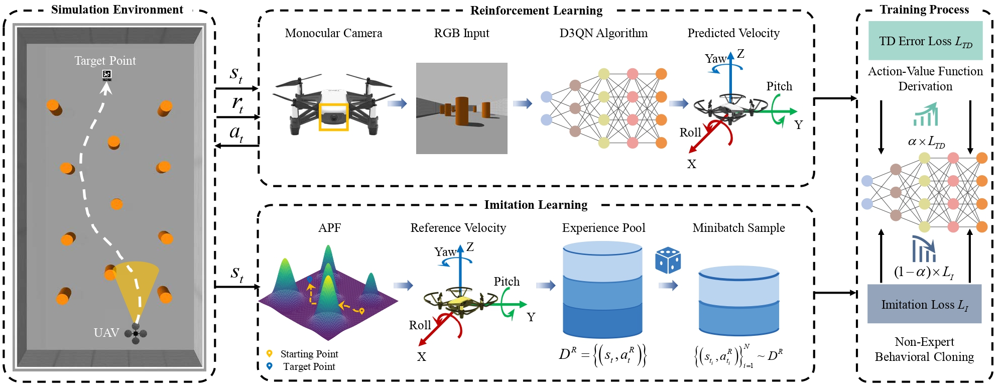
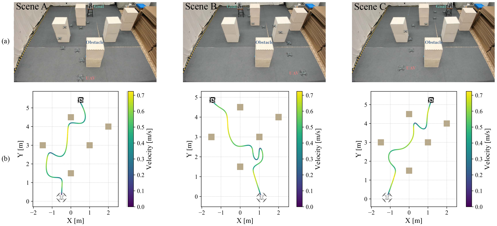
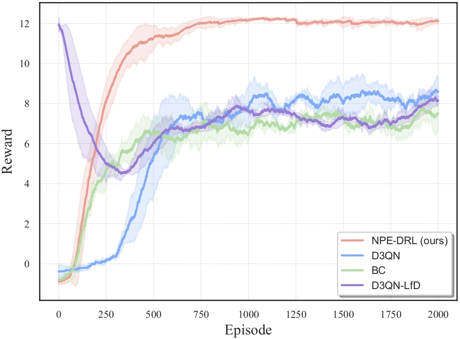
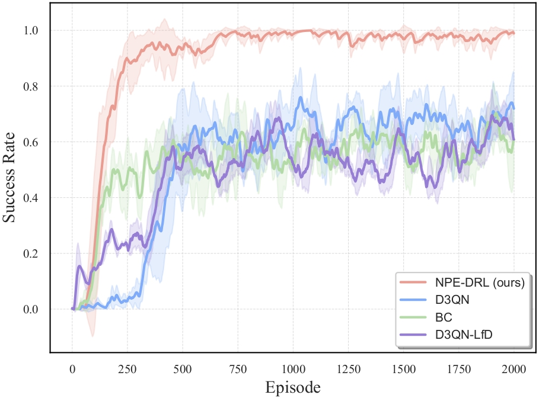
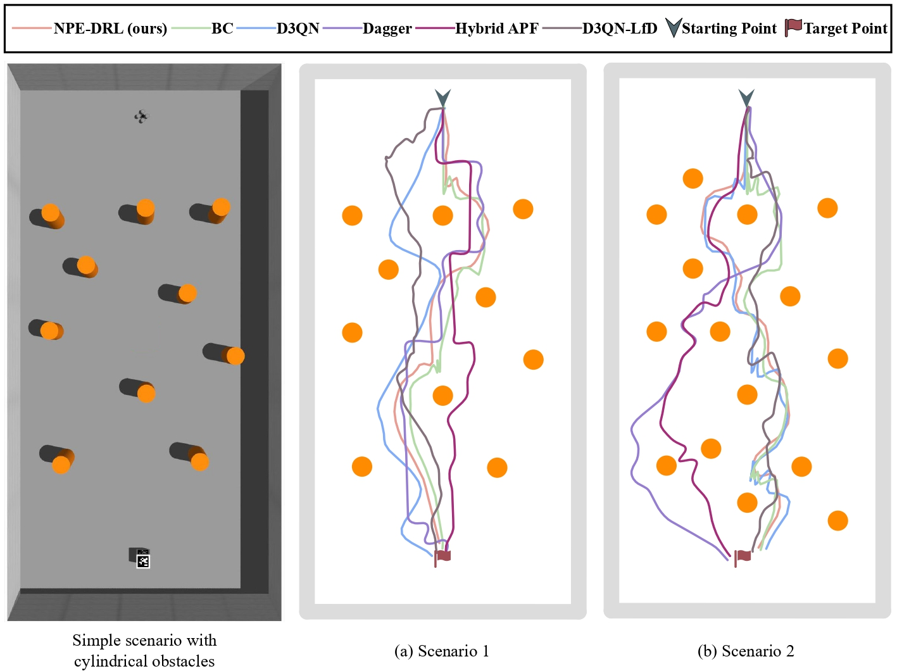
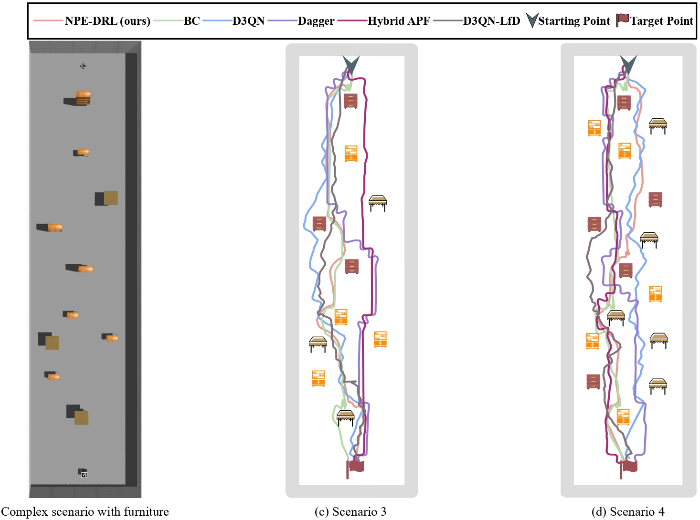

# NonExpert-Guided-Visual-UAV-Navigation-Gazebo
A Gazebo-based framework that enhances perception-constrained UAV navigation capabilities guided by non-expert reinforcement learning.

<p align="center">
  
</p>


<video width="600" controls style="border: 2px solid #ccc; border-radius: 15px; box-shadow: 0px 4px 8px rgba(0, 0, 0, 0.3);">
  <source src="./Assets/demo.mp4" type="video/mp4">
  Your browser does not support the video tag.
</video>

<p align="center">
  
</p>

<!-- Improved compatibility of back to top link: See: https://github.com/othneildrew/Best-README-Template/pull/73 -->
<a id="readme-top"></a>
<!--
*** Thanks for checking out the Best-README-Template. If you have a suggestion
*** that would make this better, please fork the repo and create a pull request
*** or simply open an issue with the tag "enhancement".
*** Don't forget to give the project a star!
*** Thanks again! Now go create something AMAZING! :D
-->


<!-- PROJECT SHIELDS -->
<!--
*** I'm using markdown "reference style" links for readability.
*** Reference links are enclosed in brackets [ ] instead of parentheses ( ).
*** See the bottom of this document for the declaration of the reference variables
*** for contributors-url, forks-url, etc. This is an optional, concise syntax you may use.
*** https://www.markdownguide.org/basic-syntax/#reference-style-links
-->
 <!--[![Contributors][contributors-shield]][contributors-url] -->
<!-- [![Forks][forks-shield]][forks-url] -->
<!--[![Stargazers][stars-shield]][stars-url] -->
<!--[![Issues][issues-shield]][issues-url] -->
[![MIT License][license-shield]][license-url] 
<!--[![LinkedIn][linkedin-shield]][linkedin-url] -->


<!-- TABLE OF CONTENTS -->
<details>
  <summary>Table of Contents</summary>
  <ol>
    <li>
      <a href="#about-the-project">About The Project</a>
      <ul>
      </ul>
    </li>
    <li>
      <a href="#getting-started">Getting Started</a>
      <ul>
        <li><a href="#prerequisites">Prerequisites</a></li>
        <li><a href="#installation">Installation</a></li>
      </ul>
    </li>
    <li><a href="#usage">Usage</a></li>
    <li><a href="#overview-of-other-scripts">Overview of Other Scripts</a></li>
    <li><a href="#results">Results</a></li>
    <li><a href="#license">License</a></li>
    <li><a href="#contact">Contact</a></li>
  </ol>
</details>


<!-- ABOUT THE PROJECT -->
## About The Project

This project focuses on enhancing the navigation capabilities of UAVs in environments with limited visual perception, using a combination of **Deep Reinforcement Learning (DRL)** and **Imitation Learning** in the Gazebo simulation environment. The DRL algorithm employed is **Dueling Double Deep Q-Network (D3QN)**. For the imitation learning component, the UAV learns from actions generated by the **Artificial Potential Field (APF)** method.

This project builds upon a previous simpler version, which can be found on GitHub: ➡️ **[gazebo_uav_RL](https://github.com/zzzzzyh111/gazebo_uav_RL)**

This work has been published in [IEEE Transactions on Artificial Intelligence](https://ieeexplore-ieee-org.remotexs.ntu.edu.sg/abstract/document/10684842). Please kindly refer to the following format for citations if needed

```bibtex
@article{zhang2024npe,
 title={NPE-DRL: Enhancing Perception Constrained Obstacle Avoidance with Non-Expert Policy Guided Reinforcement Learning},
 author={Zhang, Yuhang and Yan, Chao and Xiao, Jiaping and Feroskhan, Mir},
 journal={IEEE Transactions on Artificial Intelligence},
 year={2024},
 publisher={IEEE}
}
```

<p align="right">(<a href="#readme-top">back to top</a>)</p>


<!-- GETTING STARTED -->
## Getting Started


### Prerequisites

Make sure you have **Ubuntu**, **ROS Noetic**, and **Gazebo** properly installed before running this project.

### Installation

1. Clone the repo
   ```sh
   git clone https://github.com/zzzzzyh111/NonExpert-Guided-Visual-UAV-Navigation-Gazebo.git
   ```
2. Install required packages
   ```sh
   pip install -r requirements.txt
   ```
3. If you have your own gazebo world file, please run the code **after roslaunch**! From my side, the roslaunch command is
   ```sh
   roslaunch hector_quadrotor_gazebo quadrotor_empty_world.launch
   ```
   if not, you can refer to ➡️ **[hector-quadrotor-noetic](https://github.com/RAFALAMAO/hector-quadrotor-noetic)** for reference
4. As for the other dependencies, please install them according to your error messages. For example:
    ```sh
    sudo apt-get update
    sudo apt-get upgrade
    pip install rospkg
    pip install catkin-tools
    ```

<p align="right">(<a href="#readme-top">back to top</a>)</p>


<!-- USAGE EXAMPLES -->
## Usage

After installation, you can start training staight away by running **[`main.py`](main.py)**
```sh
python3 main.py
```

<p align="right">(<a href="#readme-top">back to top</a>)</p>

<!-- Overview of Other Scripts -->
## Overview of Other Scripts

Here is an explanation of the other important scripts used in this project:

- **[`APF_Vel_ROS.py`](APF_Vel_ROS.py)**: Defines the implementation of APF in Gazebo, used for guiding the UAV's movement.
- **[`config.py`](config.py)**: Configures the environment, including the positions of obstacles, the start point, and the target location.
- **[`ddqn.py`](ddqn.py)**: Implements the DQN algorithm along with two derived versions (Dueling DQN and Double DQN).
- **[`env.py`](env.py)**: Defines the Gazebo simulation environment, including obstacle and UAV initialization, as well as other DRL-related behaviors.
- **[`helper_functions.py`](helper_functions.py)**: Contains utility functions used during real-world drone flights.
- **[`main_APF.py`](main_APF.py)**: Implements the APF to guide the UAV's movement, showing how the potential field is used in practice.
  ```sh
  python3 main_APF.py
  ```
- **[`tello_flight.py`](tello_flight.py)**: A script for controlling a Tello drone during real-world flights, utilizing the trained models (requires Vicon or Optitrack for positioning).
  ```sh
  python3 tello_flight.py
  ```
- **[`validate.py`](validate.py)**: Defines how to use an ONNX file to evaluate the model's performance in the simulated environment.
  ```sh
  python3 validate.py.py
  ```

<p align="right">(<a href="#readme-top">back to top</a>)</p>

<!-- Results -->
## Results
<p align="center">
  
  
</p>

<p align="center">
  
  
</p>


<p align="right">(<a href="#readme-top">back to top</a>)</p>

<!-- LICENSE -->
## License

Distributed under the MIT License. See `LICENSE` for more information.

<p align="right">(<a href="#readme-top">back to top</a>)</p>


<!-- CONTACT -->
## Contact

Yuhang Zhang  - email@yuhang004@e.ntu.edu.sg

Project Link: [https://github.com/zzzzzyh111/NonExpert-Guided-Visual-UAV-Navigation-Gazebo](https://github.com/zzzzzyh111/NonExpert-Guided-Visual-UAV-Navigation-Gazebo)

<p align="right">(<a href="#readme-top">back to top</a>)</p>


<!-- MARKDOWN LINKS & IMAGES -->
<!-- https://www.markdownguide.org/basic-syntax/#reference-style-links -->
[contributors-shield]: https://img.shields.io/github/contributors/github_username/repo_name.svg?style=for-the-badge
[contributors-url]: https://github.com/github_username/repo_name/graphs/contributors
[forks-shield]: https://img.shields.io/github/forks/github_username/repo_name.svg?style=for-the-badge
[forks-url]: https://github.com/github_username/repo_name/network/members
[stars-shield]: https://img.shields.io/github/stars/github_username/repo_name.svg?style=for-the-badge
[stars-url]: https://github.com/github_username/repo_name/stargazers
[issues-shield]: https://img.shields.io/github/issues/github_username/repo_name.svg?style=for-the-badge
[issues-url]: https://github.com/github_username/repo_name/issues
[license-shield]: https://img.shields.io/github/license/othneildrew/Best-README-Template.svg?style=for-the-badge
[license-url]: https://github.com/zzzzzyh111/NonExpert-Guided-Visual-UAV-Navigation-Gazebo/blob/main/LICENSE
[linkedin-shield]: https://img.shields.io/badge/-LinkedIn-black.svg?style=for-the-badge&logo=linkedin&colorB=555
[linkedin-url]: https://linkedin.com/in/linkedin_username
[product-screenshot]: images/screenshot.png
[Next.js]: https://img.shields.io/badge/next.js-000000?style=for-the-badge&logo=nextdotjs&logoColor=white
[Next-url]: https://nextjs.org/
[React.js]: https://img.shields.io/badge/React-20232A?style=for-the-badge&logo=react&logoColor=61DAFB
[React-url]: https://reactjs.org/
[Vue.js]: https://img.shields.io/badge/Vue.js-35495E?style=for-the-badge&logo=vuedotjs&logoColor=4FC08D
[Vue-url]: https://vuejs.org/
[Angular.io]: https://img.shields.io/badge/Angular-DD0031?style=for-the-badge&logo=angular&logoColor=white
[Angular-url]: https://angular.io/
[Svelte.dev]: https://img.shields.io/badge/Svelte-4A4A55?style=for-the-badge&logo=svelte&logoColor=FF3E00
[Svelte-url]: https://svelte.dev/
[Laravel.com]: https://img.shields.io/badge/Laravel-FF2D20?style=for-the-badge&logo=laravel&logoColor=white
[Laravel-url]: https://laravel.com
[Bootstrap.com]: https://img.shields.io/badge/Bootstrap-563D7C?style=for-the-badge&logo=bootstrap&logoColor=white
[Bootstrap-url]: https://getbootstrap.com
[JQuery.com]: https://img.shields.io/badge/jQuery-0769AD?style=for-the-badge&logo=jquery&logoColor=white
[JQuery-url]: https://jquery.com 
